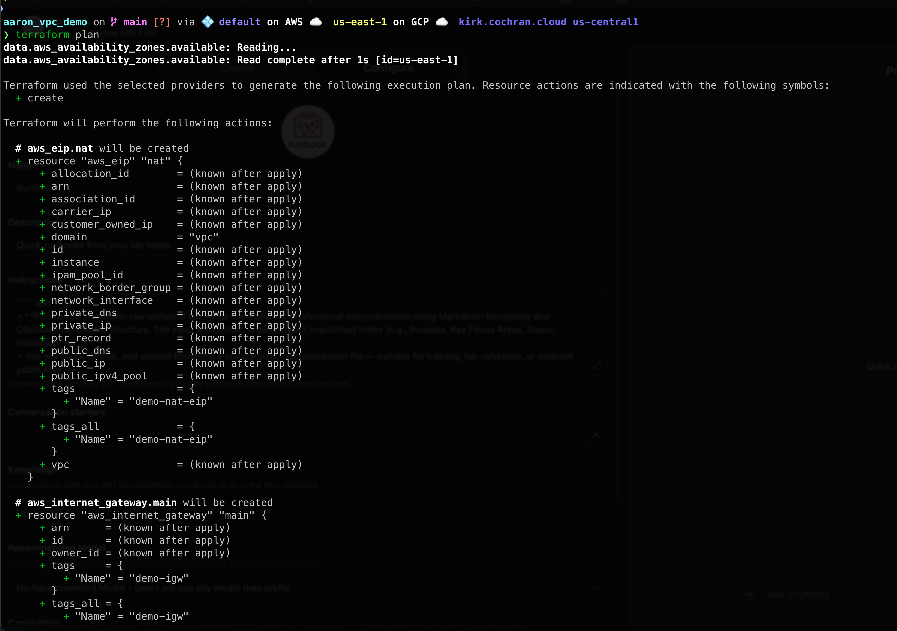
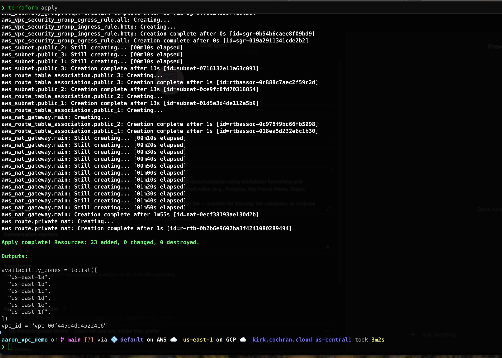

# Deploy Aaron’s VPC Demo
**Date:** 10-18-2025
<br>
**Class:** Class. 7 AWS

---
## **Purpose**
This lab demonstrates how to deploy and tear down a simple AWS VPC using Terraform. You'll clone a preconfigured Terraform project, initialize it, validate the configuration, plan and apply the deployment, then verify the results in Terraform and the AWS Console. After deployment, you’ll destroy the infrastructure and confirm its removal in Terraform and the AWS console.

---
## Prerequisites and Skill Requirements
- Completion of [Terraform Dry Run](./terraform_dry_run.md)
- [View additional prerequisites and skill requirements here.](./prerequisites.md)

---
## **Stage 1: Set Up the Project Folder**

### **Step 1.2: Clone Aaron’s VPC Demo Repository**

Clone the preconfigured VPC demo repository. This is a standalone version I created based on [Aaron’s original VPC lab notes.](https://github.com/aaron-dm-mcdonald/Class7-notes/tree/main/101425) It makes it easier to clone and run independently:

```bash
git clone https://github.com/KirkAlton-Class7/aaron_vpc_demo.git
```

Navigate into the cloned folder:

```bash
cd aaron_vpc_demo
```

This folder contains a preconfigured Terraform setup that deploys Aaron's basic AWS VPC.


---

## **Stage 2: Initialize and Validate Terraform**

### **Step 2.1: Initialize Terraform**

Initialize the project and download provider plugins:

```bash
terraform init
```


### **Step 2.2: Validate Configuration**

Check for syntax or configuration errors:

```bash
terraform validate
```


---

## **Stage 3: Plan and Apply the Configuration**

### **Step 3.1: Generate the Execution Plan**

Preview the infrastructure Terraform will create:

```bash
terraform plan
```

Review the output carefully before applying changes.



### **Step 3.2: Apply the Plan**

Deploy the VPC and related resources:

```bash
terraform apply
```

When prompted, type:

```
yes
```


Terraform will create the infrastructure and generate a `terraform.tfstate` file.



---

## **Stage 4: Verify the Deployment**

### **Step 4.1: Verify Resources in Terraform State**

List all resources Terraform has deployed:

```bash
terraform state list
```


### **Step 4.2: Verify via AWS Console**

- Log in to the AWS Management Console.
- Navigate to **VPC → Your VPCs** and confirm the new VPC exists.
- Check subnets, route tables, and gateways as needed.

> The demo VPC deploys in the us-east-1 region. Make sure you select this region in the AWS console, otherwise the VPC will not appear in your list.


---

## **Stage 5: Destroy the Infrastructure**

### **Step 5.1: Tear Down the Resources**

Run the destroy command to remove all deployed resources:

```bash
terraform destroy
```

When prompted, type:

```
yes
```


Terraform should give confirmation that the infrastructure was destroyed.


### **Step 5.2: Confirm Deletion**

Verify all resources have been removed:

```bash
terraform state list
```

Should show no results (no output)


### **Step 5.3: Double-Check in AWS Console**

Return to the AWS Management Console and confirm that:
- The VPC has been deleted.
- All associated resources subnets, gateways, route tables, and other resources are removed.


---

## **Cleanup**
Remove the local demo folder if no longer needed:

```bash
cd ..
rm -rf aaron_vpc_demo
```
