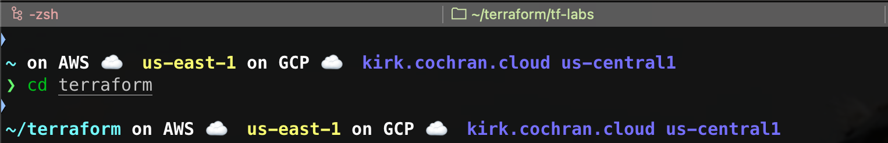
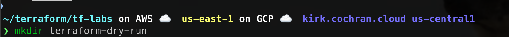
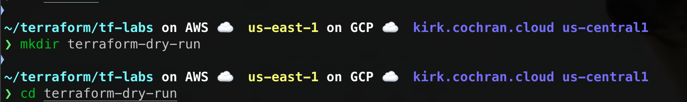
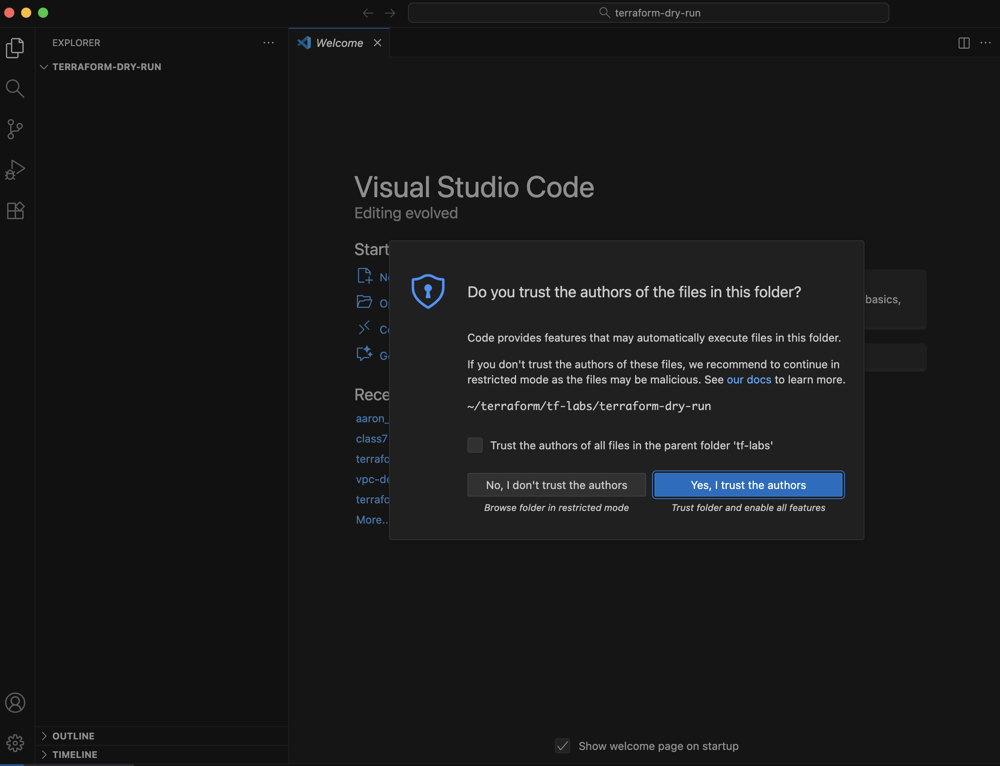
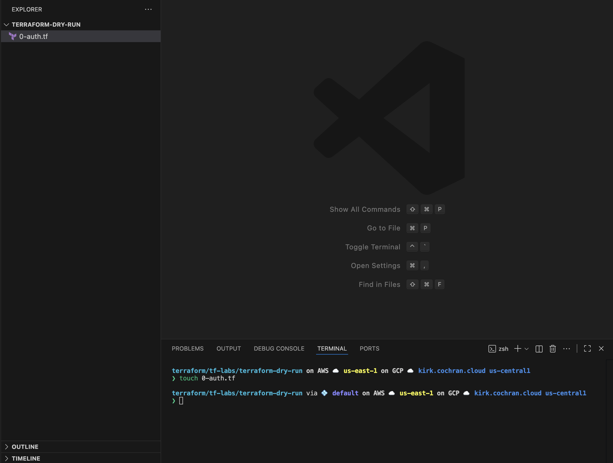
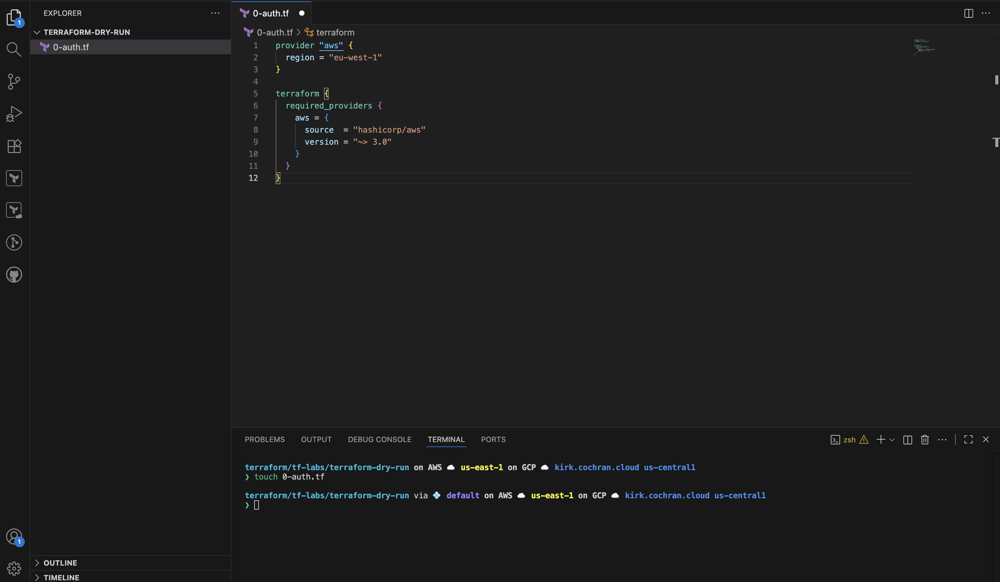
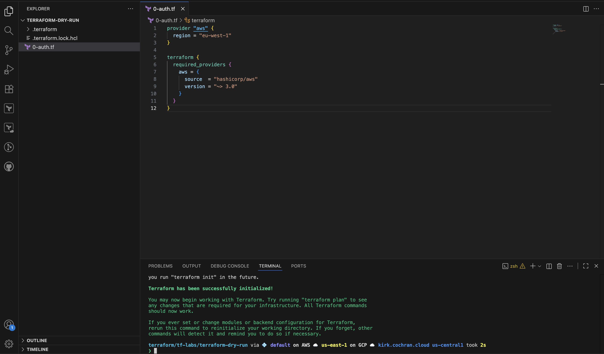
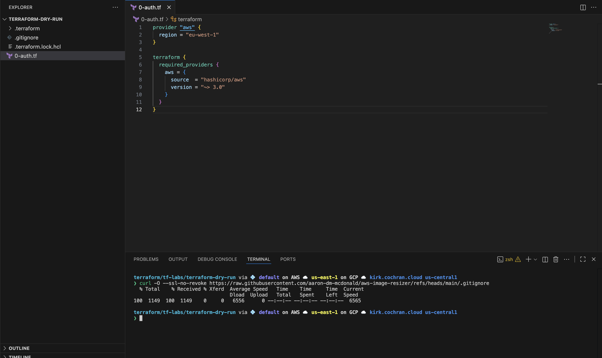
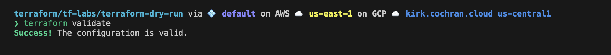
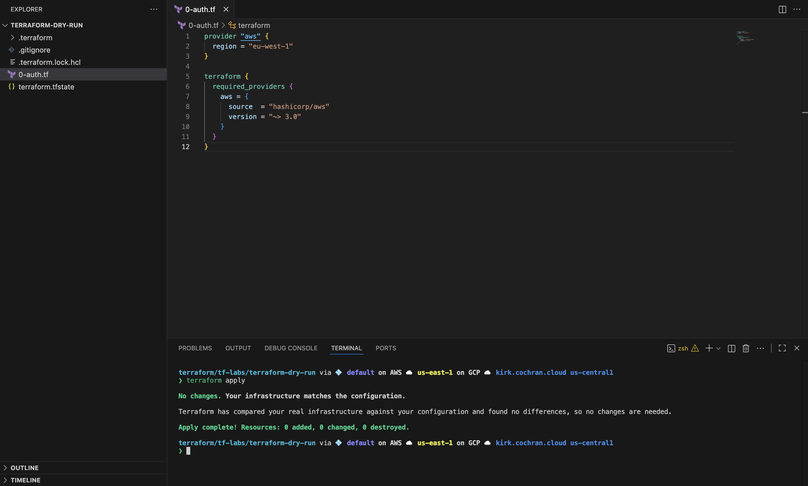

# Terraform Dry Run: Terraform Basics
**Date:** 10-14-2025
<br>
**Class:** Class. 7 AWS
<br>
**Author:** [Kirk Alton](https://github.com/KirkAlton-Class7)

---
## Purpose
This lab introduces the basic Terraform workflow through a guided dry run. You’ll practice using basic terraform commands: `terraform init`, `terraform validate`, `terraform plan`, `terraform apply`, and `terraform destroy`. You'll also learn about lock files, state files, and `.gitignore` configuration.

---
## Prerequisites and Skill Requirements
- [View prerequisites and skill requirements here.](./prerequisites.md)

---


## Stage 1: Set Up the Terraform Project Folder

### Navigate to the Terraform Working Directory
#### **1.1:** In your terminal (or Gitbash on Windows), navigate to the Terraform working directory.
This could be your `/Documents/TheoWAF/Terraform` folder or another directory if you're comfortable setting up your own project structure.

```bash
cd ~/TheoWAF/Terraform/
```


### Create the Project Directory
#### **1.2:** Create a new working directory for this dry run:

```bash
mkdir terraform-dry-run
```


#### **1.3:** cd into the directory

```bash
cd terraform-dry-run
```

The terminal should show the name of your new project directory



---

## Stage 2: View the Project in VS Code

### 1. Open the Directory in VS Code
In your terminal, run:

```bash
code .
```

When prompted, click **“Yes, I trust the authors”**.

> [!CAUTION]  
> Do not click “Trust the authors of all files in the parent folder.”  
> Always follow the Principle of Least Privilege when granting access.


### 2. Open your terminal in VS Code
Open the terminal in VS Code by selecting it from the UI panel or pressing `Ctrl` + `backtick`

---

## Stage 3: Set Up the Authentication File

### 1. Create a new Terraform file.

```bash
touch 0-auth.tf
```

> Reserve the naming convention `00-auth.tf` or `0-auth.tf` for Terraform configuration files that define how Terraform authenticates with providers (AWS, GCP, Azure, etc.).



### 2. Modify the Authentication File
- Click `0-auth.tf` in VS Code to open it
- Copy and paste the raw contents from the `0-Auth.tf` file in [this TheoWAF Terraform repo](https://github.com/malgus-waf/class5)
- Save the file.

> [!CAUTION]  
> If you don’t save the file, it doesn’t exist. Saving writes your changes to disk so Terraform can read and apply them.



> [!NOTE]  
> The line below sets a version constraint, which requires Terraform to use provider versions greater than 3.0.

```terraform
version = "~> 3.0"
```


---

## Stage 4: Initialize Terraform

### 4.1: Run the initialization command:

```bash
terraform init
```

Terraform will:
- Create a `.terraform/` directory
- Generate a `.terraform.lock.hcl` file

> [!WARNING]
> **DO NOT MODIFY THESE FILES.**  
> They are automatically managed and critical for running Terraform.


### 4.2: The Terraform Pledge

**Hold your right hand to your heart and type this oath (with your left hand)**

> I, FULL NAME, promise to **NEVER** touch the `.terraform` folder or any dotfiles that are auto generated by running `terraform.init`.

---

## Stage 5: Configure `.gitignore`

### 5.1: Download the standard `.gitignore` file from [Aaron](https://github.com/aaron-dm-mcdonald)
Run this command in the terminal, while in your Terraform project directory,

```bash
curl -O --ssl-no-revoke https://raw.githubusercontent.com/aaron-dm-mcdonald/aws-image-resizer/refs/heads/main/.gitignore
```


>**Note:** This `.gitignore` file prevents sensitive or auto-generated files (like `.tfstate`, `.tfvars`, and provider credentials) from being tracked in version control.


### 5.2: Study the `.gitignore` file 
- Below is the `.gitignore` you downloaded.
- Review the comments to understand which files are left untracked and why. Ignoring these files is important for Terraform's security, stability, and consistency.

>As you gain experience, you may need to create or adjust `.gitignore` rules to fit specific project requirements. Study this basic configuration so you understand best practices.

```bash
# Local .terraform directories
**/.terraform/*


# .tfstate files
*.tfstate
*.tfstate.*

# Crash log files
crash.log
crash.*.log

# Exclude all .tfvars files, which are likely to contain sensitive data, such as
# passwords, private keys, and other secrets. These should not be part of version
# control as they are data points which are potentially sensitive and subject
# to change depending on the environment.
*.tfvars
*.tfvars.json

# Ignore override files as they are usually used to override resources locally and so
# are not checked in
override.tf
override.tf.json
*_override.tf
*_override.tf.json

# Ignore transient lock info files created by terraform apply
.terraform.tfstate.lock.info

# Include override files you do wish to add to version control using negated pattern
# !example_override.tf

# Include tfplan files to ignore the plan output of command: terraform plan -out=tfplan
# example: *tfplan*

# Ignore CLI configuration files
.terraformrc
terraform.rc

# lock files
*.terraform.lock.hcl.*
.terraform.lock.hcl

# Ignore keys
*.json 
!tests/event.json
!tests/output.json
*.pem

#ignore packages
*.rpm
rpm_packages/
*.zip

venv/
```

---

## Stage 6: Validate, Plan and Apply the Configuration
### 6.1: Validate the Configuration
`terraform validate` checks if your configuration syntax is valid.
In your terminal, run:

```bash
terraform validate
```

The result should resemble the image below:


#### 6.2: Plan the Execution
`terraform plan` executes a dry run of your configuration and shows the actions Terraform would take without making any actual changes.
In your terminal, run:

```bash
terraform plan
```


The result should resemble the image below:



#### 6.3 Apply the Plan
`terraform apply` executes the planned actions and creates a `terraform.tfstate` file that Terraform uses to track and manage your infrastructure.

```bash
terraform apply
```

The result should resemble the image below:


**WARNING:**  
> Never modify, erase, or manually edit the `terraform.tfstate` file.

>Notice how the state file icon resembles a spine. It’s the backbone of your Terraform project.
>Remember: _Step on a crack, break your mother’s back;
>**Touch the state, your project will break.**_
####  State File Pledge

**Hold your right hand to your heart and type this oath (with your left hand)**

> _“I, FULL NAME, promise to **NEVER** touch the `terraform.tfstate` file that was auto-generated by running `terraform apply`.”_
